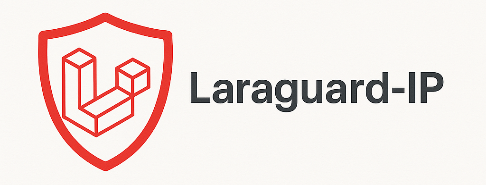

<h1 align="center">🚫 Laraguard-IP</h1>

<p align="center">
    
</p>

A powerful Laravel package to protect your application using IP-based, country-based, and spam-blacklist-based middleware.

> Created with ❤️ by [Neeraj Saini](https://www.haxneeraj.com) _(opens in new tab)_

[](https://badge.fury.io/gh/haxneeraj/laraguard-ip)
[](https://github.com/haxneeraj/laraguard-ip/blob/main/LICENSE)
[](https://github.com/haxneeraj/laraguard-ip/releases)

---

## ✨ Features

- ✅ IP Whitelist Only Mode
- 🌍 Country Whitelist Mode (GeoIP-based) (COMING SOON)
- ❌ Spam Protection using blocklists (like AbuseIPDB)
- 🧠 IP compression & JSON-based caching
- 🛡️ Middleware-based access control
- 🛠️ Artisan command to fetch & cache spam IPs

---

## 📦 Installation

```bash
composer require haxneeraj/laraguard-ip
```

---

## 🛠 Configuration

### 1. Add the Service Provider

Add the service provider to the `config/app.php` file (this step may be optional if you're using Laravel's package auto-discovery):

**For Laravel 10 and below:**

```php
    'providers' => [
        // Other service providers...
        Haxneeraj\LaraguardIp\Providers\LaraguardIpServiceProvider::class,
    ],
```

**For Laravel 11:**
Add the service provider to the `bootstrap/providers.php` file (this step may be optional if you're using Laravel's package auto-discovery):

```php
    return [
        // Other service providers...
        Haxneeraj\LaraguardIp\Providers\LaraguardIpServiceProvider::class,
    ];
```

### 2. Publish the config file

```bash
php artisan vendor:publish --provider="Haxneeraj\LaraguardIp\Providers\LaraguardIpServiceProvider" --tag=config
```

This will create a config file at:

```
config/laraguard-ip.php
```

---

## 🧹 Middleware Usage

The middleware is automatically registered via the package's service provider.  
You can directly use it in your routes like this:

### Apply to Routes

```php
Route::middleware(['laraguard-ip'])->group(function () {
    // Protected routes
});
```

---

## ⚙️ Configuration Options

Here's a summary of available config values:

| Key                           | Description                         | Default                                     |
| ----------------------------- | ----------------------------------- | ------------------------------------------- |
| `laraguardip_spam_protection` | Enable blocklist protection         | `false`                                     |
| `whitelist_only_access`       | Only allow IPs in `whitelist_ips`   | `false`                                     |
| `country_whitelist_only`      | Only allow from `country_whitelist` | `false`                                     |
| `whitelist_ips`               | Safe IPs                            | `['127.0.0.1']`                             |
| `country_whitelist`           | Allowed ISO country codes           | `['IN', 'US']`                              |
| `sources`                     | Blocklist sources (URL)             | AbuseIPDB                                   |
| `path`                        | Blocklist storage path              | `storage/framework/cache/laraguard-ip.json` |
| `compress`                    | Enable IP compression               | `true`                                      |

---

## 🔁 Fetch & Cache Blacklist IPs

You can fetch and store the latest spam IPs from the defined sources:

```bash
php artisan laraguardip:update
```

- Downloads IPs from `config('laraguard-ip.sources')`
- Saves to `laraguard-ip.json`
- Caches the list forever using Laravel's Cache

---

## ❓ How It Works

- ⛔ Denies access if IP is not whitelisted (if enabled)
- 🌍 Blocks requests from unwanted countries (if enabled)
- ❌ Checks IPs against blacklist
- 📂 Cache and config driven – no DB required

---

## 🧪 Example `.env`

```env
LARAGUARDIP_SPAM_PROTECTION=true
LARAGUARDIP_WHITELIST_ONLY=false
LARAGUARDIP_COUNTRY_WHITELIST_ONLY=false
LARAGUARDIP_STORAGE_PATH=framework/cache/laraguard-ip.json
LARAGUARDIP_STORAGE_COMPRESS=true
```

---

## 🧪 Tests

This package comes with feature and unit tests to ensure everything works smoothly.

### 🏃 Run Tests

```bash
composer test
```

---

## 🧠 Want to Contribute?

Pull requests are welcome! Feel free to fork, raise issues or drop ideas.

---

## 📄 License

MIT © [Neeraj Saini](https://www.haxneeraj.com) _(opens in new tab)_
